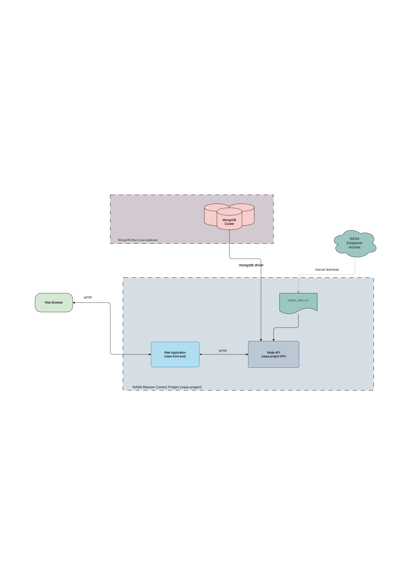

# NASA Mission Control Project

Part of Zero To Mastery Academy training

###### :

##### Tech stack:
- [JavaScript](https://developer.mozilla.org/en-US/docs/Web/JavaScript)
- [JSON](https://json.org/)
- [Express JS](https://expressjs.com/)
- [CSS](https://developer.mozilla.org/pt-BR/docs/Web/CSS)
- [NodeJs](https://nodejs.org/)
- [ReactJs](https://reactjs.org/)
- [NASA Exoplanet Archive](https://exoplanetarchive.ipac.caltech.edu/docs/data.html)

## Running the Project

1. In the terminal, run: `npm run deploy`
2. Browse to the mission control frontend at [localhost:8000](http://localhost:8000) and schedule an interstellar launch!

## Running the Tests

To run any automated tests, run `npm test`. This will: 
* Run all the client-side tests: `npm test --prefix client`
* Run all the server-side tests: `npm test --prefix server` 